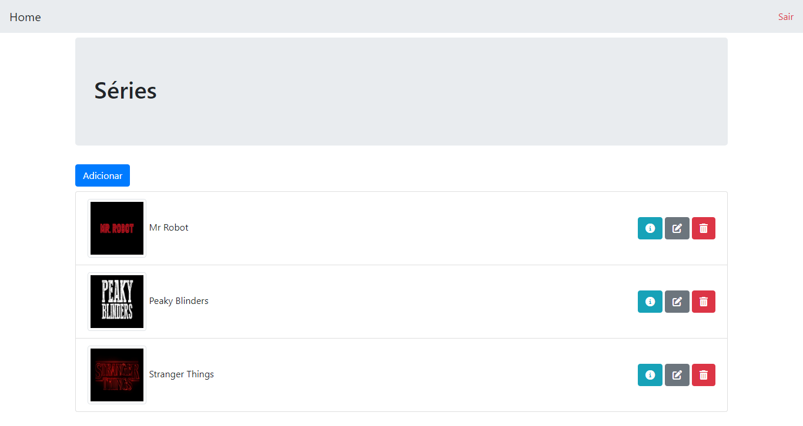

<h1 align="center">Series Control</h1>

<p align="center">
  
</p>

## :rocket: Tecnologias

Esse projeto foi desenvolvido com as seguintes tecnologias:

- [Laravel](https://laravel.com/)
- [MySQL](https://www.mysql.com/)

## :computer: Projeto

Series Control é um projeto básico para cadastrar séries, controlar temporadas e episódios assistidos

## :man_technologist: Recursos

CRUD - Create, Read, Update e Delete

## :hammer_and_wrench: Setup

- Laravel 5.8
- PHP 7.4 (PHP 8 não roda com essa versão do Laravel)
- MySQL 8

```
git clone https://github.com/aleffelipe96/SeriesControl5.8.git
```

```
cd SeriesControl5.8
```

```
composer install
```

```
composer update
```

- Criar uma cópia do (.env.example) e renomear apenas para (.env)

```
php artisan key:generate
```

- Criar um banco de dados no MySQL e colocar um nome à sua escolha. OBS: Esse nome deve ser utilizado em DB_DATABASE no (.env). No caso deixei o nome 'series_control'

- Inserir as seguintes informações no (.env) e as credenciais do banco de dados conforme o MySQL estiver configurado na sua máquina (Usuário e Senha)

```
APP_URL=http://localhost:8000

FILESYSTEM_DRIVER=public

DB_CONNECTION=mysql
DB_HOST=127.0.0.1
DB_PORT=3306
DB_DATABASE=series_control
DB_USERNAME=root
DB_PASSWORD=
```

- Rodar as migrations e popular as tabelas em 1 só comando:

```
php artisan migrate --seed
```

```
php artisan serve
```

- Acessar http://localhost:8000/ clicar em 'entrar' e inserir as credenciais:

```
E-mail: elon@teste.com
Senha: elon123
```

- Pronto, agora é só testar o CRUD desse projeto

## :warning: Suguestões e Melhorias

Caso encontre alguma falha ou queira sugerir melhorias dentro da proposta desse pequeno projeto, basta entrar em contato
